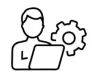
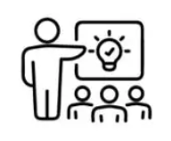
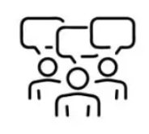
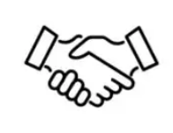
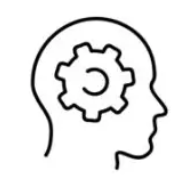

# Cultura de equipo

Estos valores representan la esencia de la cultura de equipo que me gusta promover, y establecen el estándar para cada decisión y acción en nuestro trabajo del día a día.

---

##  **Responsabilidad**

- **Transparencia** en la comunicación sobre el progreso y los obstáculos.
- **Cumplimiento** de compromisos.
- **Búsqueda de soluciones** antes de escalar problemas.

### **Metodología**:

- **Daily** como espacio de alineamiento y desbloqueo de obstáculos.
- **Retrospectivas** para analizar problemas y futuras acciones que los mejoren.

### **Ejemplo**:

- Planeamos y accionamos en vez de reaccionar y quejarnos.
- Si alguien se bloquea en una tarea, levanta la mano y damos prioridad a desbloquearlo.
- Llevamos la responsabilidad de la entrega desde la definición hasta la entrega de valor al usuario.

---

##   **Mejora continua**

- **Autoevaluación** y aprendizaje constante.
- **Excelencia** técnica y de proceso.
- **Flexibilidad** al cambio.
- **Convertir errores** en oportunidades.

### **Metodología**:

- **Feedback continuo**: coffeedbacks, feedback 360.
- **Dinámicas de revisión** de procesos constantes y acordados por todos.
- **Lean practices**: maximizar el valor entregado reduciendo desperdicios
- **Vertical slicing**: desarrollo iterativo e incremental

### **Ejemplo**:

- Cuando hay cambios en el equipo (o cosas que sentimos que no funcionan), replanteamos los procesos. Hemos cambiado de Kanban a Sprint y viceversa tan pronto como hemos sentido que nos iba a resolver problemas que teníamos en ese momento.

---

##   **Colaboración**

- **Responsabilidad** compartida.
- **Toma de decisiones** en equipo.
- **Trabajar la confianza**.

### **Metodología**:

- **Pair programming** (no sólo como método de compartir conocimiento).
- **Dinámicas de equipo** para conocerse mejor (sobretodo en equipos remotos).

### **Ejemplo**:

- Las tareas del sprint no son de nadie, el equipo se reorganiza en el momento en el que se necesite para dar prioridad a entregar la tarea que más cerca esté de aportar valor al producto.
- Trabajamos si es posible todo el equipo en la misma iniciativa, evitamos nichos de conocimiento y aseguramos que entregamos valor cuanto antes.

---

##   **Respeto**

- **Comunicación** abierta y constructiva.
- **Cuidar motivaciones** individuales.

### **Metodología**:

- **Mentorías individuales** (hard & soft skills).
- **1&1 semanal**.

### **Ejemplo**:

- Durante los debates de equipo, se busca que cada persona pueda dar su opinión, buscando dinámicas que permitan que todo el mundo tenga su espacio.

---

##   **Autonomía**

- **Proactividad** para resolver problemas de manera independiente.
- **Consciencia** del contexto y toma de decisiones acorde a ello.
- **Capacidad** de identificar y asumir riesgos de manera calculada.

### **Metodología**:

- **Refinamiento técnico** en equipo.
- **Facilitación de dinámicas** de equipo por parte del individual contributor.

### **Ejemplo**:

- Reconocemos que no sabemos cómo hacer o mejorar algo sin miedo.

---

##   **Ownership**

- **Compromiso** con la calidad de cada entrega.
- **Enfoque** en el resultado y no solo en las tareas asignadas.
- **Toma de decisiones** alineadas con los objetivos del proyecto.

### **Metodología**:

- **Code Review** en pair.
- **Participación** en dinámicas del equipo de Producto.

### **Ejemplo**:

- Entregamos historias de usuario frente a tareas puramente técnicas.
- Creamos círculos de trabajo temáticos (frontend, backend, arquitectura…) dónde tratamos de entender la deuda técnica o limitantes relacionados y buscamos estrategias para poder resolverlo.
