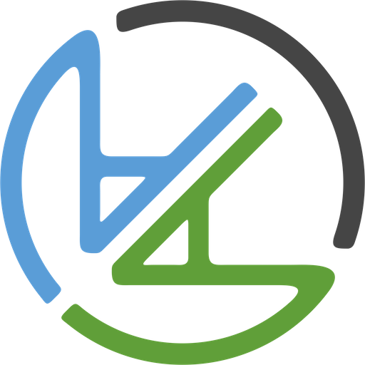
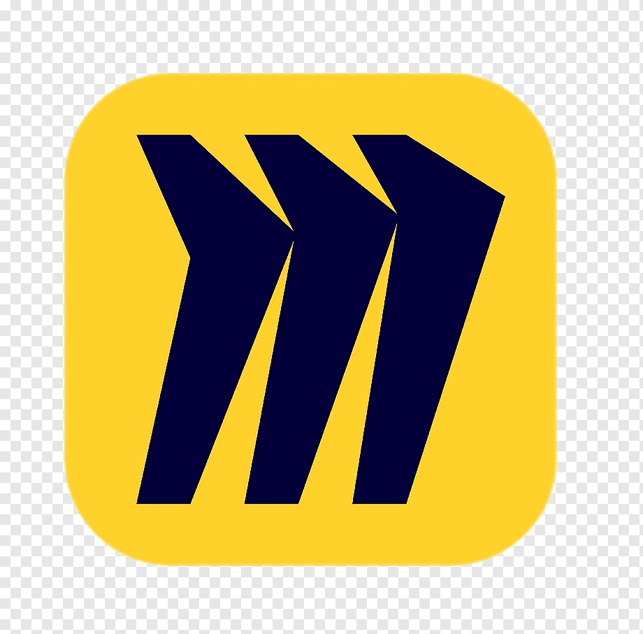
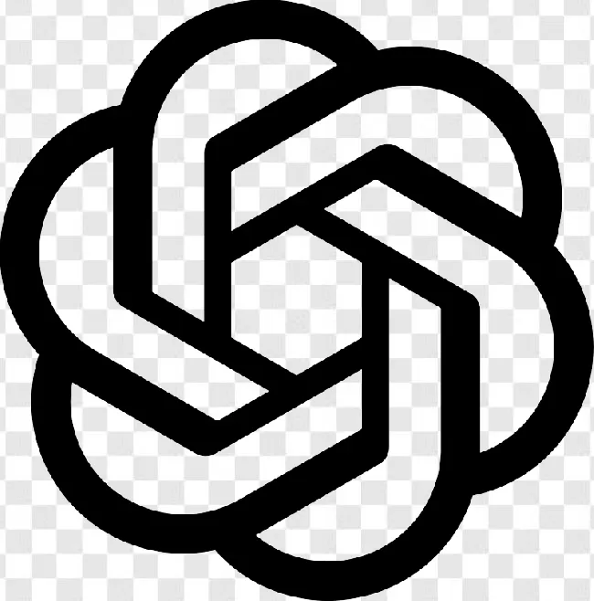

# Tools
Estas son algunas de las herramientas que más he utilizado. Sin embargo, la selección de ellas depende del contexto del equipo y las necesidades específicas de la empresa, por lo que deben variar o explorarse nuevas opciones según la situación.

##  Jira
- **Para qué lo utilizamos**: Lo utilizamos para la gestión de las iniciativas, desde su creación, pasando por la documentación y ejecución. Es la manera más clara de visibilizar el trabajo del equipo.
- https://www.atlassian.com/software/jira

##  Actionable Agile
- **Para qué lo utilizamos**: Analizar las métricas de rendimiento del equipo, como el flujo de trabajo, la velocidad y la predictibilidad. Estas métricas nos ayudan a ajustar procesos y asegurar que el equipo esté funcionando de manera eficiente.
- https://www.actionableagile.com/

##  Notion
- **Para qué lo utilizamos**: Es la herramienta principal para la documentación del equipo. Utilizamos Notion para detallar procedimientos, buenas prácticas, guías de código y cualquier otra información relevante.
- https://www.notion.so/

##  Miro
- **Para qué lo utilizamos**: Creamos diagramas de flujo, mapas de procesos y realizamos dinámicas de equipo. Miro es ideal para sesiones de brainstorming o cuando necesitamos visualizar y colaborar en ideas de manera interactiva. A veces también nos sirve para documentar flujos del producto e incluso de funcionamiento técnico.
- https://miro.com/

##  Gather
- **Para qué lo utilizamos**: Facilitamos la comunicación síncrona en un espacio virtual. Gather es como un espacio de trabajo físico, donde el equipo puede moverse entre diferentes áreas, facilitando conversaciones más naturales y colaborativas.
- https://www.gather.town/

##  Slack
- **Para qué lo utilizamos**: Es la herramienta para la comunicación asíncrona. Aquí compartimos actualizaciones, resolvemos dudas rápidas y mantenemos al equipo al tanto de los avances sin necesidad de interrumpir el flujo de trabajo.
- https://slack.com/

##  Live Share
- **Para qué lo utilizamos**: Facilita la colaboración técnica en tiempo real.
- https://visualstudio.microsoft.com/services/live-share/

##  Chat GPT / GitHub Copilot
- **Para qué lo utilizamos**: Aumenta la productividad del equipo. Chat GPT nos ayuda con tareas documentación, generación de ideas, vertical slicing..., mientras que GitHub Copilot nos ayuda a reducir el tiempo dedicado a codificar tareas simples, repetitivas, generación de test e incluso a reducir los tiempos de resolución de errores.
- https://chat.openai.com/ / https://copilot.github.com/